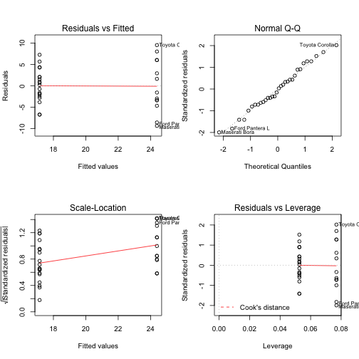

Data Products Assigments - Shiny app pitch
========================================================
author: Federico Roman  
date: 23/10/2015

Summary
========================================================

Is an automatic or manual transmission better for MPG? It is a common belief that changing gears manually results in better fuel management. We will test this hypotesis by using a dataset extracted from the 1974 Motor Trend US magazine.

The Shiny app will allow your quickly create a simple regression model using all the variables in the dataset.

Data-set 
========================================================
This Shiny app will create a Simple Regression Model using any of the columns in 'mtcars' dataset. Here are the columns you can use:

```r
data(mtcars)
names(mtcars)
```

```
 [1] "mpg"  "cyl"  "disp" "hp"   "drat" "wt"   "qsec" "vs"   "am"   "gear"
[11] "carb"
```

The regression model
========================================================
When you select  *X* and *Y* variables the app will use this two variables to fit a simple regression model.


```r
fit <- lm(mpg~am, data = mtcars)
summary(fit)
```

```

Call:
lm(formula = mpg ~ am, data = mtcars)

Residuals:
    Min      1Q  Median      3Q     Max 
-9.3923 -3.0923 -0.2974  3.2439  9.5077 

Coefficients:
            Estimate Std. Error t value Pr(>|t|)    
(Intercept)   17.147      1.125  15.247 1.13e-15 ***
am             7.245      1.764   4.106 0.000285 ***
---
Signif. codes:  0 '***' 0.001 '**' 0.01 '*' 0.05 '.' 0.1 ' ' 1

Residual standard error: 4.902 on 30 degrees of freedom
Multiple R-squared:  0.3598,	Adjusted R-squared:  0.3385 
F-statistic: 16.86 on 1 and 30 DF,  p-value: 0.000285
```

The Shiny app output 
========================================================
The application will produce a set of four plots: residuals versus fitted values, a Q-Q plot of standardized residuals, a scale-location plot (square roots of standardized residuals versus fitted values, and a plot of residuals versus leverage that adds bands corresponding to Cook's distances of 0.5 and 1.

 

With this information you will speed up your analysis by spotting out what variables have a strong correlation.
